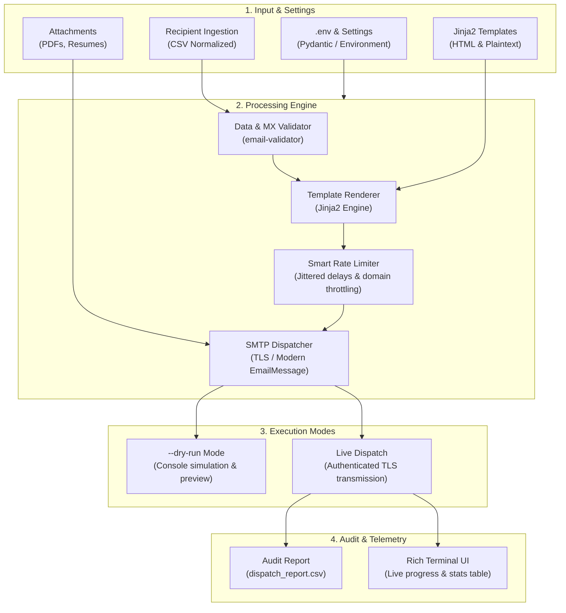

# 📬 ColdMail Automation Engine

<div align="center">

[](https://python.org)
[](https://opensource.org/licenses/MIT)
[-brightgreen.svg)](tests/)
[](https://github.com/astral-sh/ruff)
[](#architecture)

**A privacy-first, modular CLI cold-emailing and campaign engine engineered for deliverability, anti-spam resilience, and seamless personalization.**

[Key Features](#key-features) • [Architecture](#architecture) • [Quickstart](#quickstart) • [CLI Reference](#cli-command-reference) • [Deliverability Guide](#deliverability--anti-spam-guardrails)

</div>

---

## 🌟 Overview

Most cold email scripts are fragile, single-file hacks that hardcode sensitive credentials, trigger spam filters with predictable sleep timers, and lack validation guardrails.

**ColdMail** is an engineered open-source solution designed for developers, job hunters, and technical outreach. It decouples business logic, templating, and configuration while providing **jittered dispatch cadences**, **domain velocity throttling**, **dual-MIME rendering** (HTML with automatic spam-fallback plaintext), and **zero-risk dry-run simulation**.

---

## 🏗️ Architecture



---

## ✨ Key Features

| Feature | Description | Benefit |
| :--- | :--- | :--- |
| **🛡️ Privacy & Zero Leakage** | Complete separation of secrets via `.env` and `.gitignore` guardrails. | Zero risk of pushing passwords or contact lists to Git. |
| **⏱️ Jittered Rate Limiting** | Randomizes delay intervals (e.g. 8s–18s) instead of static delays. | Prevents heuristic spam detection by Gmail, Outlook, and SendGrid. |
| **🌐 Domain Velocity Throttling** | Enforces a configurable cap on consecutive emails sent to a single domain. | Avoids corporate firewall rate-limiting and temporary IP bans. |
| **📝 Dual-MIME Templating** | Generates both HTML and clean plaintext fallbacks using Jinja2. | Maximizes inbox placement and satisfies mail server spam filters. |
| **🧪 Sandbox `--dry-run`** | Simulates full campaign executions without connecting to SMTP or sending emails. | Test and verify copy, variables, and delays with 100% confidence. |
| **📊 Rich Terminal UX** | Built with Typer and Rich for visual progress bars and formatted audit tables. | Intuitive CLI with real-time feedback and execution logging. |

---

## 🚀 Quickstart

### 1. Installation
Clone the repository and install dependencies:

```bash
git clone https://github.com/s3arajgupta/Cold-Emails-Automation.git
cd Cold-Emails-Automation

# Create and activate virtual environment
python -m venv venv
# Windows:
.\venv\Scripts\activate
# macOS/Linux:
source venv/bin/activate

# Install in editable mode
pip install -e .
```

### 2. Configure Credentials
Initialize your `.env` configuration:

```bash
coldmail init
```
Open `.env` in your editor and provide your sender info and SMTP credentials:
```env
SMTP_EMAIL="your_email@gmail.com"
SMTP_PASSWORD="your-16-char-app-password"
SMTP_NAME="Swaraj Gupta"
SMTP_TITLE="Full-Stack Data & MLOps Engineer"
```

> **Using Gmail?** Enable 2-Step Verification and generate a 16-character [Google App Password](https://myaccount.google.com/apppasswords). Never use your personal account password.

### 3. Validate Recipient Contacts
Verify syntax, deduplicate contacts, and check CSV formatting:

```bash
coldmail validate data/recipients.sample.csv
```

### 4. Preview Rendered Email
Inspect how your email will look for the first recipient:

```bash
coldmail preview --template job_outreach.html
```

### 5. Run Campaign in Simulation Mode
Execute a zero-cost dry-run to verify timings, subject lines, and outputs:

```bash
coldmail run --dry-run
```

### 6. Live Outreach
When ready, dispatch your campaign with safety jitter delays:

```bash
coldmail run --csv data/recipients.csv --template job_outreach.html --attach attachments/Resume.pdf
```

---

## 🛠️ CLI Command Reference

### `coldmail init`
Creates a `.env` configuration file from `.env.example` and verifies directory scaffolding (`data/`, `templates/`, `attachments/`).

### `coldmail validate [CSV_PATH]`
Inspects a recipient file for valid headers, RFC-compliant email syntax, and duplicate addresses.
* `--check-mx`: Enable live DNS MX record checks to ensure destination domains accept mail.

### `coldmail preview`
Renders the subject line, plaintext fallback, and HTML code for a recipient directly in the terminal.
* `-t, --template TEXT`: Template file inside `templates/` (Default: `job_outreach.html`).
* `-s, --subject TEXT`: Jinja-templated subject line.
* `--csv PATH`: Path to recipient CSV file.

### `coldmail run`
Executes the campaign dispatch engine.
* `--dry-run`: Run simulation mode without transmitting emails.
* `-t, --template TEXT`: Jinja2 template name.
* `-s, --subject TEXT`: Email subject template (e.g. `"Opportunities at {{ company }} | {{ sender_name }}"`).
* `-a, --attach PATH`: Attach one or more files (can be specified multiple times).
* `-n, --limit INTEGER`: Limit total emails sent in the current session.
* `--delay-min FLOAT`: Minimum delay in seconds (Default: `8.0`).
* `--delay-max FLOAT`: Maximum delay in seconds (Default: `18.0`).
* `--log PATH`: CSV audit report output path (Default: `dispatch_report.csv`).

---

## 🛡️ Deliverability & Anti-Spam Guardrails

Sending outreach emails from personal or business accounts requires adherence to modern mail server policies:

1. **Jitter Delays**: Mail Transfer Agents (MTAs) flag accounts sending emails at robotic, fixed intervals (e.g., exactly every 7 seconds). ColdMail randomizes intervals between `delay-min` and `delay-max`.
2. **Domain Throttling**: Blasting 20 emails in 2 minutes to employees at the same `@company.com` triggers domain-level rate limiting. ColdMail automatically tracks and limits sends per domain.
3. **Dual-MIME Content**: Pure HTML emails with no plaintext alternative receive higher spam scores from SpamAssassin. ColdMail compiles both `text/html` and `text/plain` parts into every `EmailMessage`.
4. **Audit Trail**: Every execution generates a structured `dispatch_report.csv` recording timestamp, recipient, delay taken, and error diagnostics for full accountability.

---

## 🧪 Testing & Quality Assurance

This repository includes a Pytest suite validating email syntax checking, duplicate handling, template compilation, jitter calculations, and mock SMTP connections:

```bash
# Run test suite
python -m pytest tests/ -v
```

Output:
```text
tests/test_limiter.py::test_rate_limiter_domain_throttle PASSED          [ 25%]
tests/test_limiter.py::test_rate_limiter_jitter_dry_run PASSED           [ 50%]
tests/test_sender.py::test_dry_run_dispatch PASSED                       [ 75%]
tests/test_sender.py::test_build_message PASSED                          [ 87%]
tests/test_templating.py::test_strip_html_tags PASSED                    [ 90%]
tests/test_templating.py::test_template_renderer PASSED                  [ 95%]
tests/test_validator.py::test_validate_email_syntax PASSED              [ 98%]
tests/test_validator.py::test_load_and_validate_recipients PASSED        [100%]

============================== 8 passed in 0.04s ==============================
```

---

## 📁 Repository Structure

```text
Cold-Emails-Automation/
├── .env.example              # Template configuration with setup instructions
├── .gitignore                # Safeguards credentials, logs, and private data
├── pyproject.toml            # Modern Python packaging and dependency config
├── README.md                 # Complete project documentation and guide
├── LICENSE                   # MIT License
├── master.py                 # Clean backward-compatible entrypoint
├── data/
│   └── recipients.sample.csv # Mock contact dataset for testing
├── templates/
│   ├── job_outreach.html     # Responsive HTML email layout
│   ├── job_outreach.txt      # Plaintext anti-spam fallback
│   ├── follow_up.html        # Concise follow-up template
│   └── follow_up.txt         # Plaintext follow-up fallback
├── src/
│   └── coldmail/
│       ├── __init__.py       # Package definition
│       ├── cli.py            # Typer & Rich CLI implementation
│       ├── config.py         # Environment settings loader
│       ├── limiter.py        # Jitter delays & domain velocity limiter
│       ├── models.py         # Data models (Recipient, Draft, Result)
│       ├── sender.py         # SMTP TLS manager & EmailMessage builder
│       ├── templating.py     # Jinja2 rendering engine
│       └── validator.py      # CSV validation & syntax verification
└── tests/
    ├── test_limiter.py       # Rate limiting & jitter unit tests
    ├── test_sender.py        # Message building & mock dispatch tests
    ├── test_templating.py    # Template compilation unit tests
    └── test_validator.py     # CSV parsing & email validation tests
```

---

## 📄 License

Distributed under the **MIT License**. See [`LICENSE`](LICENSE) for details.
